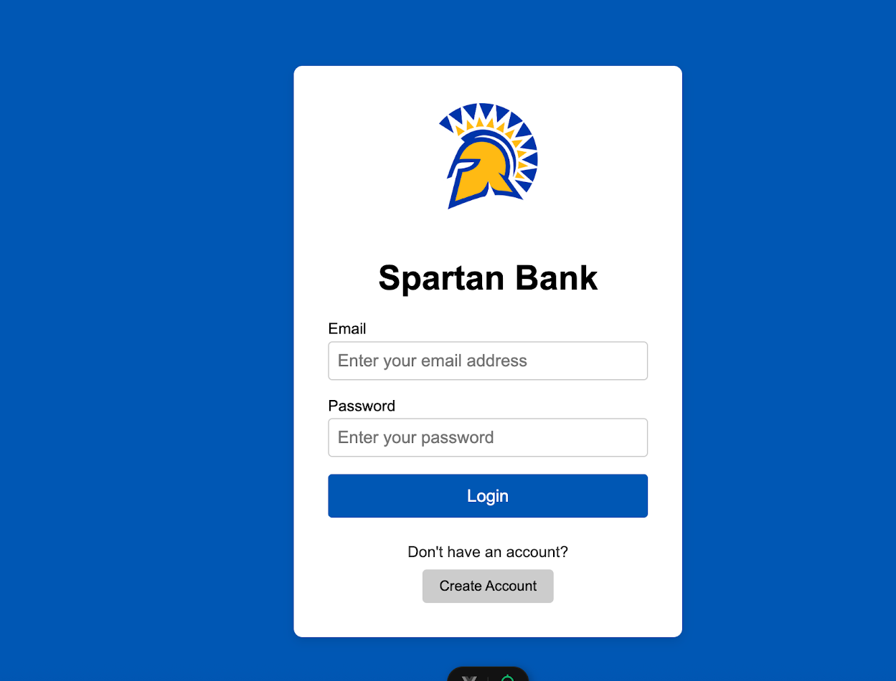
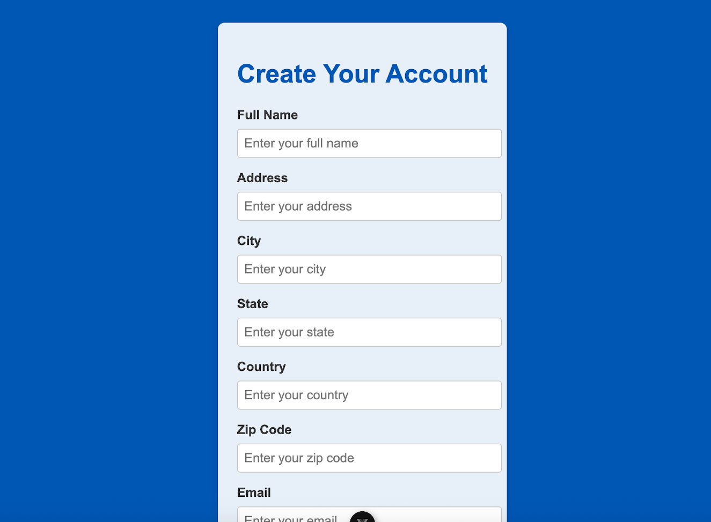

# 🏦 Spartan Bank  

**Group Members:**  
- Margarita Rincon  
- Jonathan Etiz  

---

## 📖 Project Overview  
**Spartan Bank** is a **mock-banking application** developed for CS 157A. It simulates key banking operations and provides a secure interface for managing user accounts.  

🔹 Features include:  
- 🔑 User authentication & request validation  
- 💸 Balance transfers between personal accounts or to other users  
- 📲 Mobile check deposits  
- 🔐 Password management (change/reset)  
- 👤 Update user information  
- 💰 Option to open savings accounts  
- 📝 Customer registration  

---

## 🛠️ Tech Stack  

  
  
  
  
  
  

---

## 📦 Dependencies & Required Software  

- **Backend:** Pseudo-RESTful API served by **Apache Tomcat 11.0.1**  
- **Frontend:** **Vue.js** app (requires **Node.js** & **npm**)  
- **Database:** **PostgreSQL 16.0**  

---

## 📸 Screenshots  
**Login Screen**  
  

**SignUp Screen**  
  


<!-- Add screenshots or demo GIFs here -->

---
## 🚀 Running the Program

1. Ensure all dependencies above are installed.
2. Create a PostgreSQL user and database called 'bankingapp' 
3. Navigate to your Apache Tomcat installation directory, then `/conf`
    - Modify `context.xml` to have the following lines of code enclosed in the `<Context> ... </Context>` block:
        - Change `<POSTGRESQL SERVER ADDRESS>` to the IP address of your PostgresQL server
        - Modify the password to whatever you sent when creating the user
        - Alternatively, use the server address `direct.etiz.dev` with the password `cs157a` (this will be taken down after the assignment is graded)
    ```
    <Resource name="jdbc/postgresql" auth="Container" type="javax.sql.DataSource"
          username="bankingapp"
          password="<password>"
          driverClassName="org.postgresql.Driver"
          url="jdbc:postgresql://<POSTGRESQL SERVER ADDRESS>:5432/bankingapp"
          maxTotal="25"
          maxIdle="10"
          validationQuery="select 1" />
    ```
    - Modify `web.xml` to have the following lines of code enclosed in the `<web-app> </web-app>` block:
    ```
    <filter>
        <filter-name>CorsFilter</filter-name>
        <filter-class>org.apache.catalina.filters.CorsFilter</filter-class>
        <init-param>
            <param-name>cors.allowed.origins</param-name>
            <param-value>*</param-value>
        </init-param>
        <init-param>
            <param-name>cors.allowed.methods</param-name>
            <param-value>GET, POST, PUT, DELETE, OPTIONS</param-value>
        </init-param>
        <init-param>
            <param-name>cors.allowed.headers</param-name>
            <param-value>Content-Type, Authorization</param-value>
        </init-param>
    </filter>
    <filter-mapping>
        <filter-name>CorsFilter</filter-name>
        <url-pattern>/*</url-pattern>
    </filter-mapping>
    ```
4. Create the database with the included `create_schema.sql`
5. Initialize data (if wanted) with the included `initialize_data.sql`
6. Run the apache tomcat server with the code contained herein
7. To run the frontend, `cd frontend` and `npm run dev`; this will launch the frontend.

## Test User
The database can be initialized with some dummy data to test functionality; below is user information for a user with transactions and accounts:

Email: john.doe@bank.com
Password: password

The password for all initialized users is `password`, but the above user is the only one guaranteed to have data.
